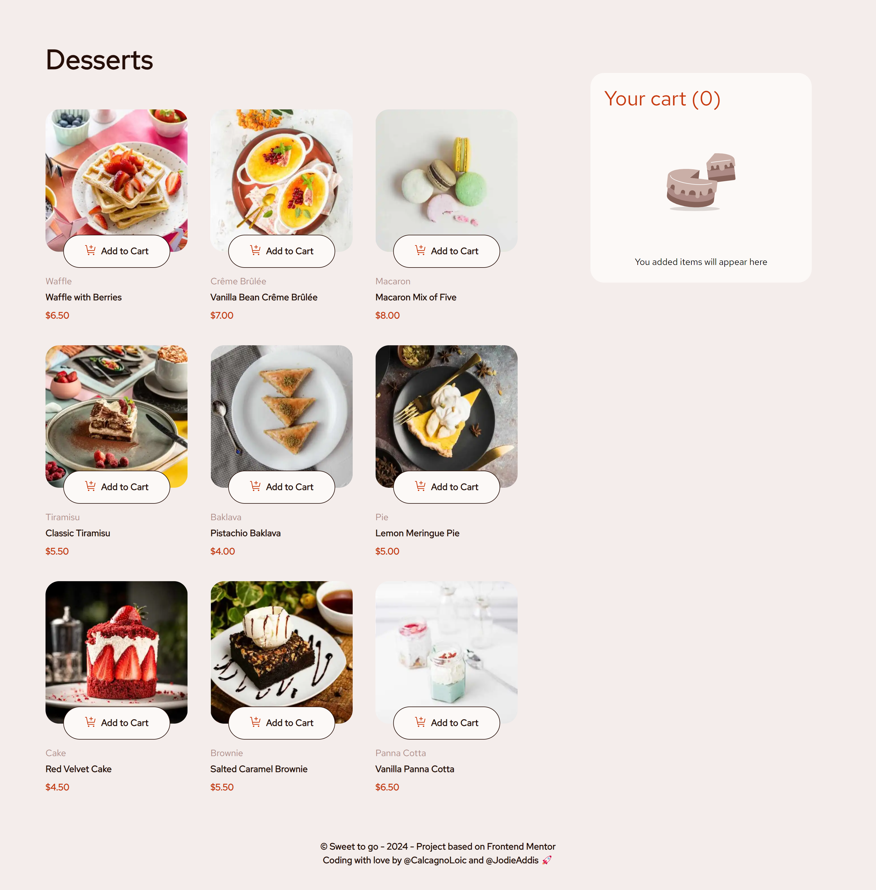
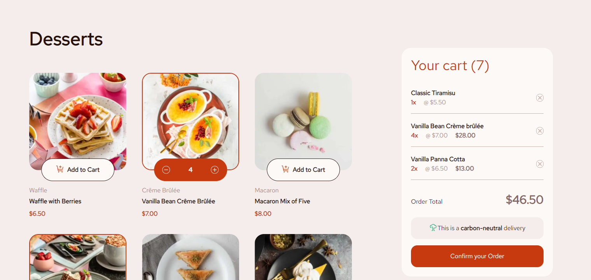
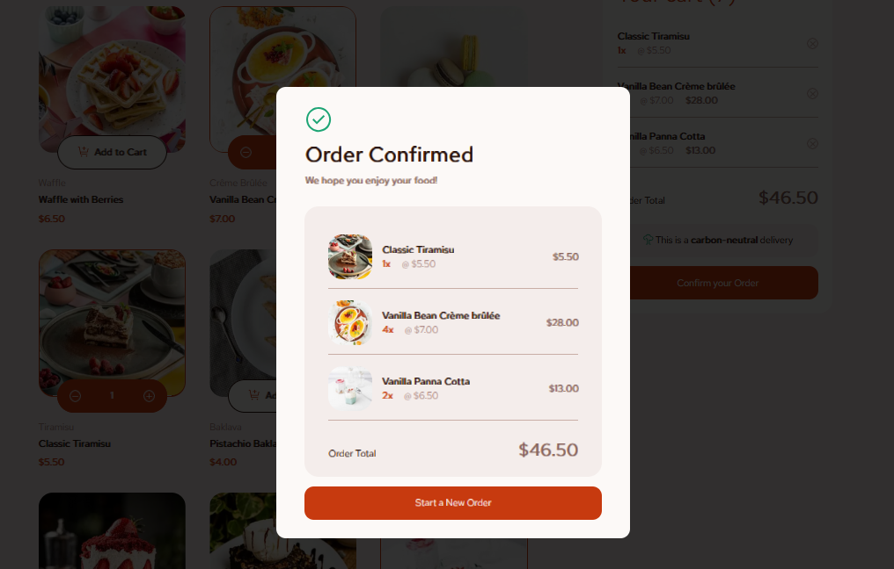

# Sweet to go 🍦

Welcome to **Sweet to Go**, an elegant and user-friendly web application designed to showcase and sell delicious desserts. Whether you're craving a classic tiramisu, a vibrant macaron mix, or a rich red velvet cake, our store has something to satisfy your sweet tooth.

  

[Lien Figma](https://www.figma.com/design/lt1WV8RAE38qCtYHQbEUIN/ecommerce-redux?node-id=0-1&t=1jCRFYWw7wDQs935-0)

    

| Adding items to Cart             | Confirmation Order                       |
| -------------------------------- | ---------------------------------------- |
|  |  |

## User stories

- [ ] Add items to the cart and remove them
- [ ] Increase/decrease the number of items in the cart
- [ ] See an order confirmation modal when they click "Confirm Order"
- [ ] Reset their selections when they click "Start New Order"
- [x] View the optimal layout for the interface depending on their device's screen size
- [x] See hover and focus states for all interactive elements on the page

## Built with

- Semantic HTML5 markup
- Mobile-first workflow
- TailwindCSS | v3.4
- React | v.18.3
- Redux Toolkit | v.2.2
- TypeScript | v.5.2
- CICD workflow

## Authors

### Jodie Addis

- [Personnal website]()
- [Linkedin]()

### Loïc Calcagno

- [Personnal website](https://calcagno-loic.netlify.app/)
- [Linkedin](https://www.linkedin.com/in/loic-calcagno/)
